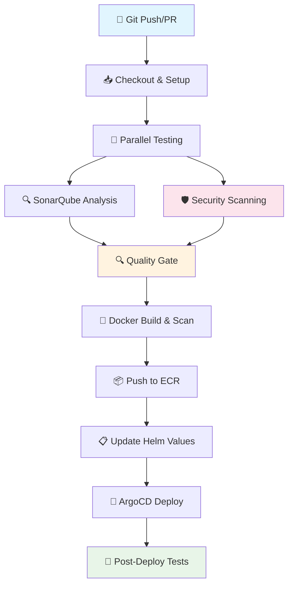

# 🚀 CI/CD Pipeline for EKS Products

A comprehensive CI/CD pipeline implementing DevSecOps best practices for the EKS Products Spring Boot microservice.

## 📋 Pipeline Overview



## 🎯 Pipeline Features

### 🏗️ **Build & Test**
- ✅ Maven compilation with Java 21
- ✅ Unit & integration tests with JaCoCo coverage
- ✅ Test result publishing and archiving
- ✅ Parallel execution for faster builds

### 🔍 **Code Quality**
- ✅ SonarQube static analysis
- ✅ Code coverage reporting (70% minimum)
- ✅ Quality gate enforcement
- ✅ Technical debt tracking

### 🛡️ **Security Scanning**
- ✅ Snyk dependency vulnerability scanning
- ✅ OWASP dependency check
- ✅ Container image security scanning
- ✅ ECR image scanning
- ✅ Configurable severity thresholds

### 🐳 **Container Management**
- ✅ Multi-architecture Docker builds (AMD64/ARM64)
- ✅ Optimized layering for fast builds
- ✅ Security-hardened containers (non-root user)
- ✅ Build metadata and labels

### 📦 **Deployment**
- ✅ AWS ECR push with multiple tags
- ✅ Helm chart updates
- ✅ ArgoCD GitOps deployment
- ✅ Environment-specific configurations
- ✅ Rollback capabilities

### 🧪 **Testing & Monitoring**
- ✅ Health checks and smoke tests
- ✅ Post-deployment validation
- ✅ Prometheus metrics integration
- ✅ Comprehensive reporting

## 🏗️ Architecture

### Repository Structure
```
eks-products/
├── 🔧 Jenkins Pipeline
│   ├── Jenkinsfile                 # Main pipeline definition
│   ├── jenkins-setup.md           # Setup documentation
│   └── CI-CD-README.md           # This file
├── 🔒 Security Configuration
│   ├── .snyk                      # Snyk security policies
│   ├── owasp-suppressions.xml     # OWASP false positive suppressions
│   └── sonar-project.properties   # SonarQube configuration
├── 🐳 Container Configuration
│   ├── Dockerfile                 # Multi-stage, multi-arch build
│   └── .dockerignore             # Docker build exclusions
├── ☸️ Kubernetes Deployment
│   ├── helm/eks-products/         # Helm chart
│   └── argocd/application.yaml    # ArgoCD applications
└── 📊 Application Code
    ├── src/                       # Java Spring Boot source
    ├── pom.xml                   # Maven with security plugins
    └── target/                   # Build artifacts
```

### Environment Flow
```
┌─────────────┐    ┌──────────────┐    ┌─────────────────┐
│   Feature   │ -> │ Development  │ -> │   Production    │
│   Branches  │    │   (develop)  │    │     (main)      │
└─────────────┘    └──────────────┘    └─────────────────┘
      │                     │                    │
      │                     │                    │
   Code Test           Full Pipeline      Production Deploy
   & Quality           + Dev Deploy       + Monitoring
```

## 🔧 Build Stages

### 1. 🔄 **Checkout & Setup**
```groovy
- Git checkout with full history
- Environment validation
- Workspace preparation
- Build metadata collection
```

### 2. 🧪 **Code Quality & Testing**
```groovy
Parallel Execution:
├── Maven Build & Test
│   ├── Compile & test-compile
│   ├── Unit tests with JaCoCo
│   ├── Package application
│   └── Publish test results
└── SonarQube Analysis
    ├── Static code analysis
    ├── Security hotspot detection
    ├── Coverage analysis
    └── Quality metrics
```

### 3. 🔐 **Security Scanning**
```groovy
Parallel Execution:
├── Snyk Dependency Scan
│   ├── Vulnerability detection
│   ├── License compliance
│   ├── Remediation advice
│   └── Dashboard monitoring
└── OWASP Dependency Check
    ├── CVE database scanning
    ├── HTML report generation
    └── Severity filtering
```

### 4. 🔍 **Quality Gate**
```groovy
- SonarQube quality gate evaluation
- Code coverage threshold (70%)
- Security rating requirements
- Maintainability standards
```

### 5. 🐳 **Docker Build & Scan**
```groovy
- Multi-platform image build
- Container vulnerability scanning
- Image metadata labeling
- Security hardening validation
```

### 6. 📦 **Registry & Deployment**
```groovy
Branch-specific flow:
├── main → Production
│   ├── ECR push with version tags
│   ├── Helm values update
│   ├── ArgoCD sync (production)
│   └── Post-deployment tests
├── develop → Development
│   ├── ECR push with dev tags
│   ├── Helm values update
│   ├── ArgoCD sync (development)
│   └── Health checks
└── feature/* → Testing only
    ├── Quality checks
    ├── Security scanning
    └── Test reporting
```

## 🔧 Configuration

### Environment Variables
| Variable | Description | Example |
|----------|-------------|---------|
| `AWS_REGION` | AWS deployment region | `us-east-1` |
| `ECR_REPOSITORY` | Container registry name | `eks-products` |
| `SNYK_SEVERITY_THRESHOLD` | Security scan threshold | `high` |
| `SONAR_QUALITY_GATE_TIMEOUT` | Quality gate timeout | `300` |

### Required Credentials
- **aws-credentials**: AWS access for ECR/EKS
- **snyk-token**: Snyk API authentication
- **sonar-token**: SonarQube authentication
- **argocd-auth-token**: ArgoCD API access
- **slack-webhook**: Notification integration

### Quality Thresholds
```yaml
Code Coverage: ≥ 70%
Security Rating: A
Maintainability: A
Reliability: A
Duplicated Lines: < 3%
```

## 🚀 Quick Start

### 1. Prerequisites
```bash
# Jenkins with required plugins
# AWS ECR repository: eks-products
# SonarQube server configured
# Snyk account with API token
# ArgoCD with applications configured
```

### 2. Pipeline Setup
```bash
# 1. Create multibranch pipeline in Jenkins
# 2. Configure GitHub repository integration
# 3. Add required credentials
# 4. Configure webhook for auto-triggers
```

### 3. First Build
```bash
# Push to develop branch triggers:
# - Full pipeline execution
# - Development deployment
# - Quality reports generation

# Push to main branch triggers:
# - Production-ready pipeline
# - Security scanning
# - Production deployment
```

## 📊 Monitoring & Reports

### Build Artifacts
- **JAR Files**: Application binaries
- **Test Reports**: JUnit XML and HTML
- **Coverage Reports**: JaCoCo XML and HTML
- **Security Reports**: Snyk JSON and OWASP HTML
- **Quality Reports**: SonarQube dashboard links

### Notifications
- **Slack**: Real-time build status updates
- **Email**: Failure notifications and summaries
- **Dashboard**: Jenkins Blue Ocean pipeline view

### Metrics Tracking
- **Build Duration**: Average and trend analysis
- **Success Rate**: Build reliability metrics
- **Code Quality**: SonarQube metrics over time
- **Security**: Vulnerability trends and remediation

## 🔧 Customization

### Adding New Environments
```yaml
# 1. Create new Helm values file
# 2. Add branch condition in Jenkinsfile
# 3. Configure ArgoCD application
# 4. Update environment variables
```

### Security Policy Updates
```yaml
# Snyk: Update .snyk file
# OWASP: Modify owasp-suppressions.xml
# SonarQube: Adjust quality gate rules
```

### Pipeline Extensions
```groovy
// Add new stage to Jenkinsfile
stage('🔧 Custom Stage') {
    steps {
        script {
            // Custom logic here
        }
    }
}
```

## 🛠️ Troubleshooting

### Common Issues

#### Build Failures
```bash
# Maven issues
mvn clean install -X  # Debug mode

# Docker build issues
docker system prune -f
docker buildx ls
```

#### Security Scan Failures
```bash
# Check Snyk token
snyk auth [token]

# Verify OWASP database
mvn dependency-check:update-only
```

#### Deployment Issues
```bash
# ArgoCD sync issues
argocd app get eks-products-prod
argocd app sync eks-products-prod --force

# kubectl access issues
aws eks update-kubeconfig --name eks-products-cluster
```

### Debug Mode
Enable detailed logging:
```groovy
environment {
    MAVEN_OPTS = '-Dmaven.repo.local=.m2/repository -X'
    BUILDKIT_PROGRESS = 'plain'
}
```

## 📚 References

- **Jenkins**: [Pipeline Documentation](https://jenkins.io/doc/book/pipeline/)
- **SonarQube**: [Quality Gates](https://docs.sonarqube.org/latest/user-guide/quality-gates/)
- **Snyk**: [CLI Documentation](https://docs.snyk.io/features/snyk-cli)
- **ArgoCD**: [Getting Started](https://argo-cd.readthedocs.io/en/stable/getting_started/)
- **Spring Boot**: [Production Ready Features](https://docs.spring.io/spring-boot/docs/current/reference/html/production-ready-features.html)

## 🤝 Contributing

1. **Fork** the repository
2. **Create** feature branch: `git checkout -b feature/pipeline-enhancement`
3. **Test** changes in development environment
4. **Submit** pull request with detailed description
5. **Ensure** all quality gates pass

---

## 📞 Support

- **DevOps Team**: `#devops-support` on Slack
- **Pipeline Issues**: Create GitHub issue with `ci/cd` label
- **Documentation**: Update this README for any changes

**Built with ❤️ by the EKS Products Team**
