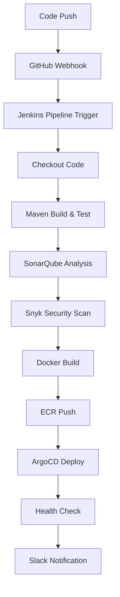

# 🏗️ Create Jenkins Pipeline for EKS Products

## Step-by-Step Pipeline Creation

### 1. 🌐 **Access Jenkins**
- URL: http://54.166.37.229:8080
- Login: `admin` / `<your-jenkins-password>`

### 2. 🆕 **Create New Pipeline Job**

#### Option A: Classic Jenkins UI
1. Click **"New Item"**
2. Enter name: `eks-products-pipeline`
3. Select **"Pipeline"**
4. Click **"OK"**

#### Option B: Blue Ocean UI (Recommended)
1. Click **"Open Blue Ocean"** or go to `/blue/`
2. Click **"Create Pipeline"**
3. Select **"GitHub"**
4. Connect to your repository: `https://github.com/GershonRocks/eks-products`

### 3. ⚙️ **Configure Pipeline**

#### Basic Configuration
- **Name**: `eks-products-pipeline`
- **Description**: `CI/CD pipeline for EKS Products application`
- **GitHub project URL**: `https://github.com/GershonRocks/eks-products`

#### Pipeline Configuration
- **Definition**: `Pipeline script from SCM`
- **SCM**: `Git`
- **Repository URL**: `https://github.com/GershonRocks/eks-products.git`
- **Credentials**: Select `github-credentials`
- **Branch**: `*/main` (or `*/develop` for dev branch)
- **Script Path**: `Jenkinsfile`

#### Build Triggers
- ✅ **GitHub hook trigger for GITScm polling**
- ✅ **Poll SCM**: `H/5 * * * *` (every 5 minutes)

#### Pipeline Options
- ✅ **Discard old builds**: Keep 10 builds
- ✅ **Do not allow concurrent builds**
- ✅ **Use Groovy Sandbox**

### 4. 🔧 **Advanced Configuration**

#### Environment Variables
Add these in **Pipeline** → **Environment**:
```properties
AWS_DEFAULT_REGION=us-east-1
DOCKER_BUILDKIT=1
MAVEN_OPTS=-Xmx2048m -XX:MaxPermSize=512m
SONAR_HOST_URL=https://sonarcloud.io
ECR_REGISTRY=your-account-id.dkr.ecr.us-east-1.amazonaws.com
ECR_REPOSITORY=eks-products
ARGOCD_SERVER=your-argocd-server-url
K8S_CLUSTER_NAME=eks-products-cluster
```

#### Parameters (Optional)
Add these build parameters:
- **DEPLOY_ENVIRONMENT**: Choice (production, development)
- **SKIP_TESTS**: Boolean (default: false)
- **FORCE_DEPLOY**: Boolean (default: false)

### 5. 📋 **Pipeline Features Available**

Your `Jenkinsfile` includes these stages:

1. **🔍 Checkout**: Clone repository
2. **🏗️ Build & Test**: Maven compile and test
3. **📊 SonarQube Analysis**: Code quality analysis
4. **🛡️ Snyk Security Scan**: Dependency and container scanning
5. **🔍 OWASP Dependency Check**: Software composition analysis
6. **🐳 Docker Build**: Multi-architecture container build
7. **📤 ECR Push**: Push to Amazon ECR
8. **🚀 ArgoCD Deploy**: Deploy via GitOps
9. **🏥 Health Check**: Post-deployment verification
10. **📢 Notifications**: Slack notifications

### 6. 🎛️ **Configure Global Tools**

Go to **Manage Jenkins** → **Global Tool Configuration**:

#### Maven
- **Name**: `Maven-3.9`
- **Install automatically**: ✅
- **Version**: `3.9.5`

#### JDK
- **Name**: `OpenJDK-21`
- **Install automatically**: ✅
- **Version**: `jdk-21.0.1+12`

#### Docker
- **Name**: `Docker`
- **Install automatically**: ✅
- **Version**: `latest`

### 7. 🔌 **Configure System Settings**

#### SonarQube Servers
**Manage Jenkins** → **Configure System** → **SonarQube servers**:
- **Name**: `SonarQube`
- **Server URL**: `https://sonarcloud.io` (or your SonarQube server)
- **Server authentication token**: Select `sonar-token`

#### Slack Configuration
**Manage Jenkins** → **Configure System** → **Slack**:
- **Workspace**: `your-workspace-name`
- **Integration Token Credential ID**: Select `slack-webhook`
- **Default channel**: `#jenkins` (or your preferred channel)

### 8. 🚀 **Test Pipeline Creation**

1. **Save** the pipeline configuration
2. Click **"Build Now"** for initial test
3. Monitor build in **Blue Ocean** for better visualization
4. Check console output for any configuration issues

### 9. 🔄 **Set Up GitHub Webhook (Optional)**

For automatic builds on code push:

1. Go to GitHub repository settings
2. **Webhooks** → **Add webhook**
3. **Payload URL**: `http://54.166.37.229:8080/github-webhook/`
4. **Content type**: `application/json`
5. **Events**: `Push events`, `Pull requests`

### 10. ✅ **Verification Checklist**

- [ ] Pipeline job created successfully
- [ ] GitHub repository connected
- [ ] All credentials configured
- [ ] Jenkinsfile detected and parsed
- [ ] Build triggers configured
- [ ] Global tools configured
- [ ] System settings configured
- [ ] Initial build test successful

## 🎯 **Expected Pipeline Flow**



## 🛟 **Troubleshooting Tips**

- **Build fails immediately**: Check credentials configuration
- **Maven build fails**: Verify JDK and Maven tool configuration
- **Docker build fails**: Ensure Docker is available on Jenkins agent
- **ECR push fails**: Verify AWS credentials and ECR repository exists
- **ArgoCD deploy fails**: Check ArgoCD token and cluster connectivity

Ready to create the pipeline? Let me know if you need help with any of these steps!
